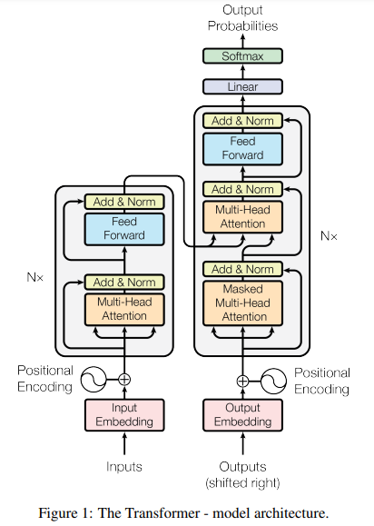

# Homemade-GPT (Generative Pre-Trained Transformer) implementation in native Python

This repository contains a native Python implementation of the Decoder portion of the Tranformer architecture introduced in the seminal paper - [Attention is all you need](https://arxiv.org/abs/1706.03762).
Figure 1 shows the complete Transformer architecture with the Encoder block on the left and Decoder block on the right.

The model is fine-tuned on the [Alpaca](https://crfm.stanford.edu/2023/03/13/alpaca.html) instruction dataset using the Alpaca prompt style.